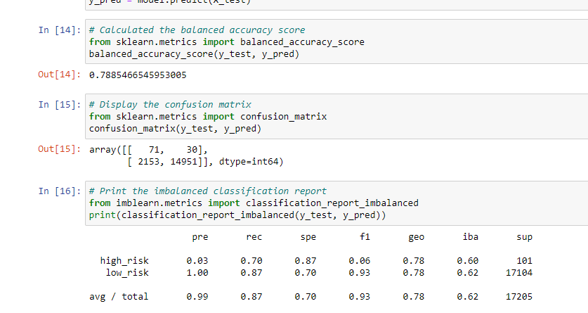

# Credit_Risk_Analysis

## Overview

I've been working with my friend Jill to build my skillset in data preparation, statistical reasoning, and machine learning. Now I've been tasked with trying to determine credit card risk using a dataset from LendingClub. Since credit risk is an unbalanced classification problem, with bad loans dwarfed by good loans, I'll be using a number of different tools to attempt my prediction: the RandomOverSampler and SMOTE algorithms to oversample the data, ClusterCentroids algorithm to undersample the data, the SMOTEENN algorithm to both over- and undersample the data, and finally, two ensemble machine learning models to reduce bias, BalancedRandomForestClassifier and EasyEnsembleClassifier. I'll evaluate the performance of each model and determine, if possible, which will be best to use. 

## Results

Each model returned the following results:

- Random Oversampling
  - Balanced Accuracy: 66.2%
  - Precision
     - High-Risk: 1%
     - Low-Risk: 100%
  - Recall
     - High-Risk: 72%
     - Low-Risk: 60%

- SMOTE Oversampling
  - Balanced Accuracy: 65.6%
  - Precision
     - High-Risk: 1%
     - Low-Risk: 100%
  - Recall
     - High-Risk: 61%
     - Low-Risk: 70%

- Undersampling
  - Balanced Accuracy: 54.4%
  - Precision
     - High-Risk: 1%
     - Low-Risk: 100%
  - Recall
     - High-Risk: 69%
     - Low-Risk: 40%

- SMOTEENN Combination Sampling
  - Balanced Accuracy: 67.8%
  - Precision
     - High-Risk: 1%
     - Low-Risk: 100%
  - Recall
     - High-Risk: 78%
     - Low-Risk: 57%

- Balanced Random Forest Classifier
  - Balanced Accuracy: 78.9%
  - Precision
     - High-Risk: 3%
     - Low-Risk: 100%
  - Recall
     - High-Risk: 70%
     - Low-Risk: 87%

- Easy Ensemble Classifier
  - Balanced Accuracy: 93.2%
  - Precision
     - High-Risk: 9%
     - Low-Risk: 100%
  - Recall
     - High-Risk: 92%
     - Low-Risk: 94%

## Summary

Out of our models, Undersampling performed the weakest overall. It did score slightly higher on High-Risk Recall over SMOTE Oversampling, but unfortunately that was its only bright spot with regards to this dataset. Random Oversampling, in turn, slightly edged out SMOTE Oversampling in performance with this data, while combining both over- and undersampling in with the SMOTEENN algorithm proved to be the best approach in the over- vs. under- sampling debate with the LendingClub data. However, none of these algorithms approach a usefulness for our predictions. 

It isn't until we use our ensemble classifiers that we can see much better results - Balanced Random Forest Classifier increases the Precision of our High-Risk classifier by 3x vs. over/undersampling and gives a solid boost to Recall scores. 

Easy Ensemble Classifier, however, increases our High-Risk Precision by 9x over over/undersampling, and takes our Recall scores into the 90% ranges, boosting our overall Accuracy up to 93.2%.

While the Easy Ensemble Classifier model we've put together is still relatively terrible at grabbing any sample and saying, "hey, this loan application is *risky*" and being *right* - it's only able to correctly do this 10% of the time on a lucky day, given the High-Risk Precision score - two things it *is* really good at doing are avoiding grabbing any sample that *is* a risky application and saying, "hey, you know, this application looks really stellar, let's approve it," and, in turn, grabbing any of the multitude of low-risk samples and saying "Woah! This one's risky!"

